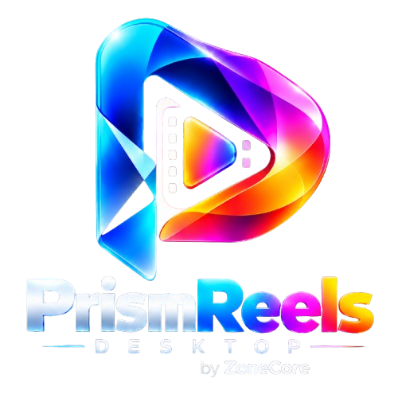
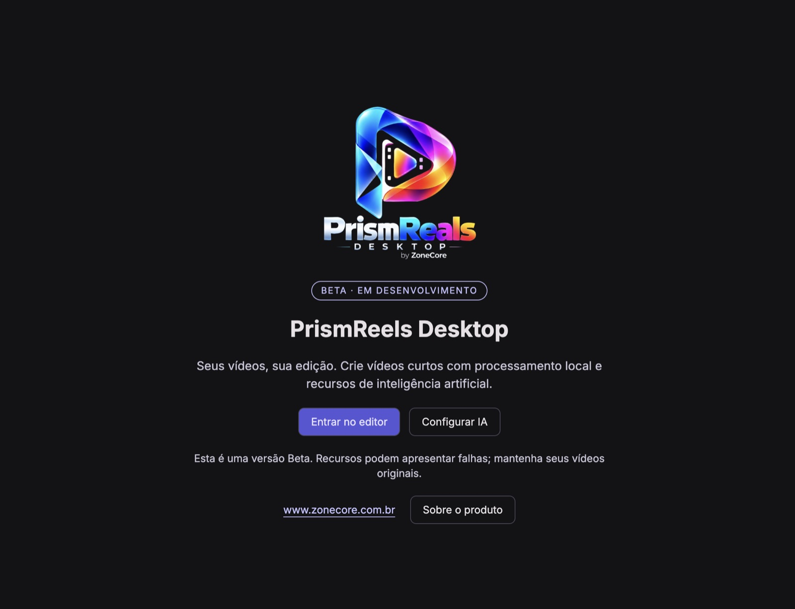
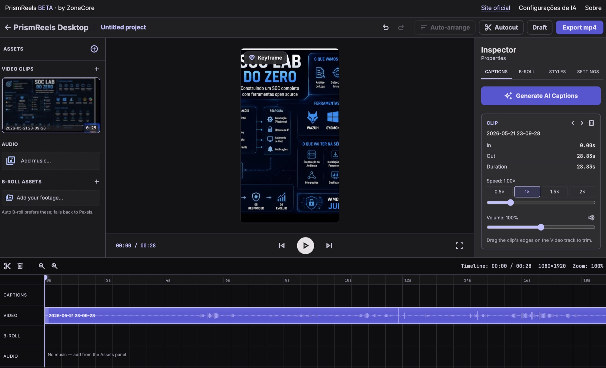

# PrismReels Desktop — Beta

Edição automática de vídeos com inteligência artificial, direto no seu Mac: envie o vídeo, diga o que quer e receba
cortes, legendas e B-roll prontos. Os vídeos são processados no seu computador e a IA usa a **sua própria chave** do
provedor.

**Download e instruções de instalação:** https://www.zonecore.com.br/prismreelsdesktop

| | |
|---|---|
| Sistema | macOS com chip Apple (M1 ou mais novo) |
| Arquivo | `.dmg` (versão 0.5.0-beta) |
| Windows e Linux | em breve |

> Versão beta: pode ter falhas. O app ainda não tem a assinatura da Apple — a página oficial mostra como abrir pela
> primeira vez e o código de verificação (SHA-256) do arquivo.

Este repositório guarda apenas os instaladores publicados como Releases; o código-fonte não fica aqui.

PrismReels by ZoneCore — empresa brasileira.
